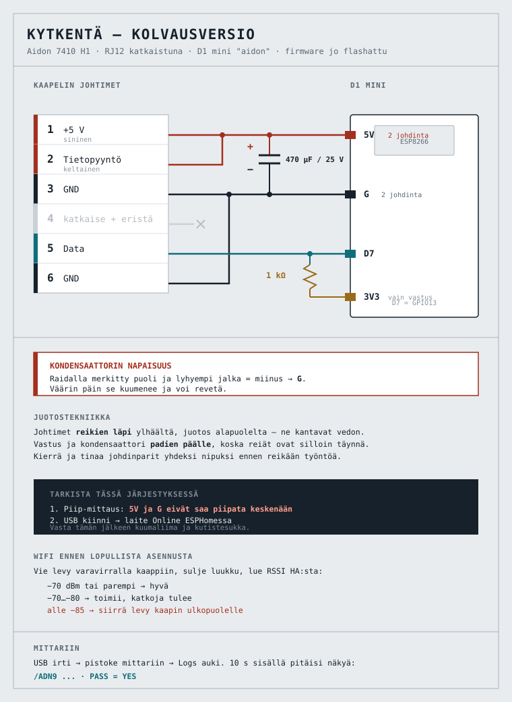
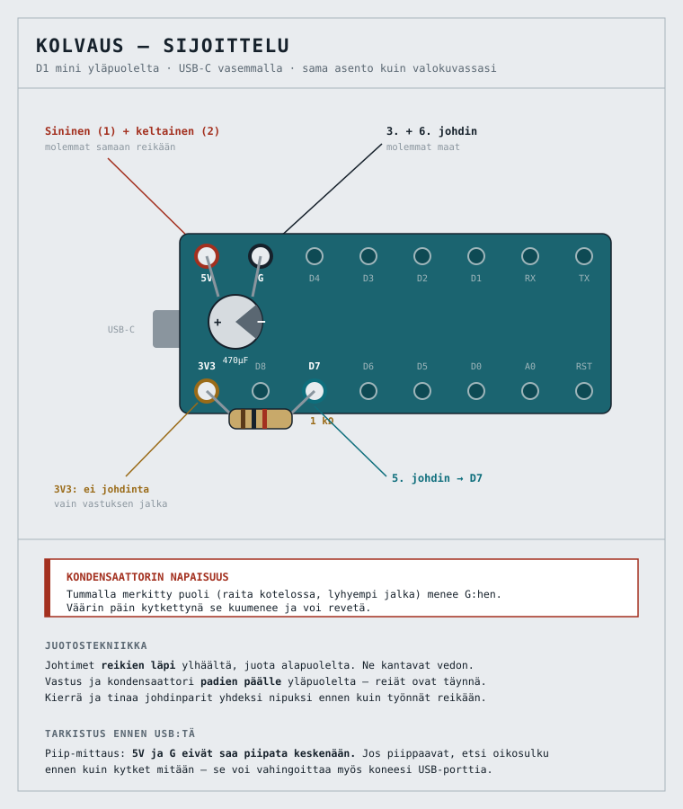

# Aidon 7410:n HAN-portista Home Assistantiin — nolla euroa ja yksi ilta

> **Rakennuskertomus, elokuu 2026.** Kirjoitettu kerran eikä päivitetä: tämä on
> tilannekuva siitä hetkestä, myös siltä osin kuin se on sittemmin vanhentunut.
> Yleiskuva: [README.md](README.md). Tekniset tiedot ja perustelut:
> [`CLAUDE.md`](CLAUDE.md).

Porvoon Sähköverkko vaihtoi mittarin. Uudessa Aidonissa on HAN-portti, ja siitä saa reaaliaikaisen kulutustiedon ulos ilman pilvipalveluita. Tässä on koko projekti alusta loppuun: mitä tilattiin, mitä juotettiin, mikä meni pieleen ja mitä lopputuloksesta näkee.

Lopputulos: kolmen vaiheen teho, virta ja jännite Home Assistantissa kymmenen sekunnin päivitysvälillä. Kustannus **nolla euroa** — kaikki osat löytyivät laatikosta. Uutena ostettuna Wemos-levy olisi noin 3 €, ja koko osalista jäisi alle viiteen.

---

## Lähtötilanne

Aidon 7410, LTE-M-yhteydellä, RJ12-muotoinen HAN-portti. Kolmivaihe, 3×25 A yleissiirto. Aurinkopaneelit katolla.

Ensimmäinen yllätys: **portti on oletuksena kuollut.** Aidonin dokumentaatio on tästä yksiselitteinen — rajapinta ei ole aktivoitu, eikä edes HAN-laitteen 5 V:n virransyöttö ole päällä ennen kuin verkkoyhtiö kytkee ne. Ei siis kannata rakentaa mitään ennen kuin tuo on hoidettu.

### Aktivointipyyntö

Porvoolla se tehdään OmaLiittymä-palvelun kautta vahvalla tunnistautumisella, tai sähköpostilla asiakaspalveluun. Maksuton.

Pyyntöön kannattaa kirjoittaa kolme asiaa:

1. HAN-portin aktivointi
2. **EFS2-profiili**, ei EFS
3. Järjestelmämoduulin firmware vähintään 1.2.143

Tuo toinen kohta on olennainen. Aidon osaa kaksi protokollaa: EFS on DLMS/COSEM-pohjainen binääri, EFS2 on ASCII-muotoinen. Kaikki avoimen lähdekoodin lukijat osaavat vain ASCII:n. Onneksi 7410-moduuli ei tue EFS:ää lainkaan, joten tämä huoli oli turha — mutta muilla moduuleilla se ei ole.

Aktivoinnin voi todeta itse: kun nastassa 1 on 5 V, se on tehty. Ei tarvitse odottaa vahvistusta.

---

## Laitevalinta: valmis vai itse

Kaksi realistista vaihtoehtoa.

**HomeWizard Wi-Fi P1** on valmis tuote noin 40 eurolla. Virallinen HA-integraatio, paikallinen API, siisti kotelo, takuu. Suomessa se toimii portin virralla ilman erillistä virtalähdettä. Jos haluaa asian toimivaksi samana iltana, tämä on oikea vastaus.

**Wemos D1 mini + ESPHome** vaatii illan ja kolvin. Vastineeksi saa kaikki mittarin lähettämät kentät (myös loistehon, jota HomeWizard ei tuo) eikä valmistajan pilvitiliä tarvita missään vaiheessa.

Valitsin jälkimmäisen kahdesta syystä: levyt olivat jo laatikossa, ja HomeWizardin käyttöönotto kulkee pakollisen pilvitilin kautta vaikka päivittäinen käyttö on paikallista.

**Yksi asia jonka olin väärässä matkalla:** luulin että ESP-reitti tarkoittaa MQTT:tä. Ei tarkoita. ESPHome käyttää omaa native-APIaan ja laite näkyy HA:ssa suoraan. MQTT tulee kuvaan vain amsleser-pohjaisilla ratkaisuilla.

### Miksi ESP8266 eikä ESP32

Portti antaa 250 mA ja ylivirtasuoja laukeaa 280 mA:ssa. Wemos D1 mini asettuu keskimäärin noin 80 mA:aan, WiFi-piikeissä 250–300 mA. ESP32-kehityslevy vetäisi selvästi enemmän ja ajaisi portin "hikkaustilaan", jossa 5 V kytketään toistuvasti päälle lyhyeksi ajaksi. Se näyttäisi käynnistyssilmukalta.

Tämä on myös syy siihen miksi kaupallinen SlimmeLezer on ESP8266-pohjainen eikä uudempi siru.

---

## Aidonin H1-rajapinta

Viralliset luvut Aidonin omasta dokumentaatiosta:

| Nasta | Signaali |
|---|---|
| 1 | +5 V, max 250 mA |
| 2 | Tietopyyntö (data request) |
| 3 | GND |
| 4 | NC |
| 5 | Data, avoin kollektori |
| 6 | GND |

Sarjaportti on kiinteä **115200 8N1**, ja sanoma lähetetään **10 sekunnin välein**. Kaapelin maksimipituus 3 m. Aktivoituna liitännästä voi ottaa tehoa jopa 1,25 W.

Kaksi seurausta kytkennälle:

**Datalähtö on avokollektori.** Se vetää linjan alas mutta ei koskaan ylös. Tarvitaan ylösvetovastus 3,3 V:iin, ja logiikka on käänteinen.

**Nastat 3 ja 6 ovat molemmat maita.** Käytännössä samaa verkkoa, mutta molempien kytkeminen on oikein eikä maksa mitään.

Tietopyynnön nastasta luulin ensin että se on pakollinen. Se ei ole — mode D tarkoittaa että mittari lähettää automaattisesti ilman pyyntöä. Silti se kannattaa vetää 5 V:iin, koska kaupalliset lukijat tekevät niin ja nasta on suojattu ylijännitteeltä ja oikosululta.

---

## Kytkentä



Osalista — kaikki tässä tapauksessa jo valmiina:

- Wemos D1 mini (ESP8266), uutena noin 3 €
- RJ12–RJ12-kaapeli, 6-johtiminen — katkaistaan toinen pää
- 1 kΩ vastus
- 470 µF / 25 V elektrolyytti, low-ESR, −40…+105 °C

Kaapelisokettia ei kannata hankkia. Ostetaan valmis kaapeli, katkaistaan toinen pää ja juotetaan johtimet suoraan levyyn. Tehdaspistoke on aina paremmin puristettu kuin itse tehty, ja mekaanisia liitoksia on yksi vähemmän.

**Tietopyynnön silta ei vaadi erillistä johtoa** — nastojen 1 ja 2 johtimet juotetaan samaan 5V-reikään.

### Johtimien tunnistus

Tämä on se kohta jossa levy kuolee jos huolimattelee. Litteän puhelinkaapelin nastajärjestys kääntyy usein päiden välillä, ja väärä johdin D7:ään syöttää 5 V suoraan GPIO:lle.

Varma menetelmä: pistoke mittariin, mittaa katkaistusta päästä yleismittarilla, etsi +5 V. Sitten pidä mustaa mittapäätä siinä johtimessa ja käy loput läpi. **Kaksi näyttää jännitteen** — ne ovat maat, ja niiden etäisyys nauhassa on 2 ja 5 askelta. Jos ei ole, kartoitus on peilikuva.

Käytännössä kaikissa paitsi yhdessä johtimessa näkyi 5 V: maat, avokollektorilähtö lepotilassa ja tietopyynnön sisäänmeno. Ainoa kuollut johdin oli nasta 4, joka ei ole kytketty mihinkään. Sen sijainti todistaa suunnan.

### Juotos



*Kuva on periaatepiirros — oman levysi silkkipainatus voi poiketa. Olennaista on missä 5V, G, D7 ja 3V3 sijaitsevat suhteessa toisiinsa.*

Sijoittelu on tähän kytkentään onnekas. **5V ja G ovat vierekkäin** samalla reunalla, joten kondensaattori menee suoraan niiden väliin lyhyillä jaloilla. **D7 ja 3V3 ovat samalla vastakkaisella reunalla** vain D8:n erottamina, joten vastus siltaa ne kahden pinnin yli. Yhtään johtoa ei tarvitse vetää levyn yli.

Työjärjestys:

1. **Kuori** johtimet noin 4 mm ja tinaa päät.
2. **Kierrä ja tinaa parit yhdeksi nipuksi** ennen reikään työntöä: sininen + keltainen yhdeksi, molemmat maat toiseksi. Kaksi erillistä johdinta samaan reikään on hankalampi kuin yksi nippu.
3. **Johtimet reikien läpi ylhäältä**, juotos alapuolelta. Ne kantavat mekaanisen rasituksen, joten ne kuuluvat reikiin.
4. **Vastus ja kondensaattori padien päälle** yläpuolelta — reiät ovat silloin täynnä. Taivuta jalat lyhyiksi.
5. **Kondensaattorin miinusjalka G:hen.** Se on lyhyempi, ja kotelossa on raidalla merkitty puoli. Väärin päin se kuumenee ja voi revetä.

Tarkistukset ennen kuin mitään kytketään:

- **5V ja G eivät saa piipata keskenään.** Oikosulku voi vahingoittaa myös koneen USB-porttia.
- **D7 piippaa** datajohtimen kanssa.
- **D7 ja 3V3 eivät piippaa**, mutta vastusalueella niiden välillä on noin 1 kΩ. Nolla tarkoittaa että vastus on oikosulussa.

Sitten USB kiinni ja katso että laite tulee Onlineksi. Se testaa 5 V:n, maan ja käynnistyksen — mutta **ei datalinjaa**, koska mittari ei ole kytkettynä. Huono D7-juotos näyttää tässä vaiheessa täysin terveeltä.

Siksi kuumaliima ja kutistesukka vasta sen jälkeen kun mittarista on nähty `PASS = YES`.

---

## ESPHome

Käytin **psvanstrom/esphome-p1reader** -komponenttia. Se on valtavirta, sillä on suurin käyttäjäkunta, ja sen dokumentoitu esimerkkisanoma on kenttä kentältä identtinen Aidonin oman EFS2-esimerkin kanssa — samat OBIS-koodit samassa järjestyksessä. Tekijä toteaa suoraan että Suomi ja Tanska käyttävät samaa konfiguraatiota kuin Ruotsi.

Vertailin sitä `phlundblom/esphome-p1mini`-projektiin. Ero on RTS:n ohjauksessa: p1reader vetää sen pysyvästi ylös, p1mini ohjaa GPIO:sta ja tarvitsee siihen LEDin ja vastuksen. Työntävällä mittarilla tuo mekanismi on turha. p1mini kannattaa vain jos lukee useampaa mittaria samalla ESP:llä.

### Konfiguraatio

Olennaiset kohdat:

```yaml
esp8266:
  board: d1_mini
  restore_from_flash: true

logger:
  baud_rate: 0          # pakollinen: vapauttaa UART0:n
  level: DEBUG

uart:
  id: uart_bus
  rx_pin:
    number: GPIO13      # = D7
    inverted: true
  baud_rate: 115200
  rx_buffer_size: 3072

p1reader:
  - id: p1reader_esp
    uart_id: uart_bus
    protocol: ascii
```

Kolme asiaa jotka pitää tietää:

**`baud_rate: 0` on pakollinen.** D7 on GPIO13, joka on ESP8266:n hardware-UART0:n vaihtoehtoinen RX-nasta. Sarjaloggaus pitää sammuttaa jotta UART vapautuu.

**Älä kopioi Slimmelezer-esimerkin uart-lohkoa.** Siinä ei ole `inverted`-lippua, koska kyseisellä levyllä on laitteistoinvertteri. Paljaalla Wemosilla lippu tarvitaan. Sensoriblokin voi kopioida sieltä sellaisenaan.

**Vastus tai transistori, ei molempia.** Projektin osalistassa on 4,7 kΩ ja 10 kΩ transistorikytkentää varten. Jos rakennat sen, jätä `inverted: true` pois. Yhden vastuksen reitti on yksinkertaisempi ja sillä lippu on päällä.

Sensorinimet ovat snake_case-muodossa: `cumulative_active_import`, `momentary_active_import_l1`, `voltage_l1`, `current_l1` ja niin edelleen. Loistehokentät toimivat myös, mutta ESPHomessa on yksikkövirhe jossa se lähettää `kVAR` kun HA odottaa `kvar` — jätin ne aluksi pois.

---

## Flashaus, eli se osa joka kesti pisimpään

### Vaiheet

**1. Luo laite ESPHomessa.** New Device → nimi → WiFi-tunnukset → ESP8266 → `d1_mini`. Skip kun se tarjoaa asennusta; levyä ei tarvitse vielä kytkeä.

Velho generoi API-salausavaimen. **Kopioi se heti talteen** — sitä kysytään Home Assistantissa myöhemmin.

**2. Täydennä YAML.** Älä korvaa velhon tiedostoa kokonaan, tai menetät avaimen. Lisää `external_components`, `uart`, `p1reader` ja sensorit, ja korvaa pelkkä `logger:` versiolla jossa on `baud_rate: 0`.

**3. Käännä.** Install → Manual download. Ensimmäinen käännös kestää muutaman minuutin, koska se hakee toolchainin ja kirjastot. Onnistuessaan lopussa lukee `Successfully compiled program` ja selain lataa `.bin`-tiedoston.

Flash-käyttöaste asettui 46,8 %:iin ja RAM 53,3 %:iin — tilaa on reilusti.

**4. Kirjoita levylle.** Levy USB:llä koneeseen, **ei kytkettynä mittariin**. Kaksi vaihtoehtoa:

- Selaimessa `web.esphome.io` → Connect → valitse portti → Install → valitse tiedosto. Vaatii Chromium-pohjaisen selaimen (Brave kelpaa) ja HTTPS:n.
- Komentoriviltä, jos palvelimella on USB-portti:

```bash
sudo esptool --port /dev/ttyUSB0 --baud 115200 \
  write_flash 0x0 firmware.bin
```

Käytä `factory`- tai perustiedostoa, ei `-ota.bin`-versiota. Jos yhteys katkeaa, laske `--baud 57600`.

Onnistuminen näkyy riveinä `Hash of data verified` ja `Hard resetting via RTS pin`.

**5. Tarkista ennen juotosta.** Levy vielä USB-virralla:

- Laite näkyy ESPHomen etusivulla **Online**
- Logs avautuu ja näyttää WiFi-yhteyden
- Tee pieni muutos ja **Install → Wirelessly** — jos OTA toimii, laitetta ei tarvitse enää koskaan purkaa kaapista

Sensorit ovat `unknown`. Odotettua, dataa ei vielä tule.

Tässä vaiheessa kannattaa myös **mitata WiFi-kuuluvuus** siinä paikassa johon levy on tulossa. Varavirtalähde ja luukku kiinni; `wifi_signal`-sensori kertoo totuuden.

### Kolme ongelmaa matkalla

Yksikään ei ollut konfiguraatiossa.

**1. Toolchain ei latautunut.** PlatformIO yrittää hakea Xtensa-kääntäjän `eu2.contabostorage.com`-osoitteesta, ja TLS-kättely kaatui viisi kertaa peräkkäin. Ei mitään tehtävissä — toinen yritys puolen tunnin päästä meni läpi. Jos tämä toistuu, syytä kannattaa etsiä DNS-suodatuksesta tai rikkinäisestä IPv6-reitityksestä.

**2. Väärä sarjaportti.** Selain näytti FT232R-laitteen ja oletin sen olevan jokin muu, koska levyllä pitäisi olla CH340. Se olikin levy. `dmesg` ratkaisi: laite irtosi ja uusi ilmestyi tarkalleen kytkentähetkellä.

Sivuhuomio: `ftdi_sio ttyUSB0: Unable to read latency timer: -32` on tavallinen kloonipiirien viesti eikä estä mitään.

**3. Oikeudet.** Tämä oli oikea syy siihen että selaimen USB flasher ei toiminut:

```
Could not open /dev/ttyUSB0: [Errno 13] Permission denied
```

Ratkaisu on `sudo usermod -a -G dialout $USER` ja uloskirjautuminen. Nopeampi kiertotie oli ajaa esptool suoraan:

```bash
sudo esptool --port /dev/ttyUSB0 --baud 115200 \
  write_flash 0x0 firmware.bin
```

Meni läpi kerralla, `Hash of data verified`.

### ESPHome kontissa

HA pyörii Container-asennuksena, joten ESPHome-lisäosaa ei ole. Se pyörii omana quadlettina:

```ini
[Container]
Image=ghcr.io/esphome/esphome:latest
ContainerName=esphome
Network=host
Volume=%h/esphome-config:/config:Z
AutoUpdate=registry
```

`Network=host` on olennainen, muuten mDNS ei toimi eikä OTA löydä levyä myöhemmin.

Koska kontti on palvelimella ja levy oli kannettavassa, ensimmäinen flashaus tehtiin **Install → Manual download** ja sen jälkeen erikseen. Vain kerran — sen jälkeen kaikki päivitykset menevät OTA:na.

---

## Lopputulos

Ensimmäinen lukema, elokuun ilta klo 20:54:

| Sensori | Arvo |
|---|---|
| Teho | 3,217 kW |
| Teho L1 / L2 / L3 | 1,004 / 1,190 / 1,029 kW |
| Virta L1 / L2 / L3 | 4,4 / 5,3 / 4,8 A |
| Jännite L1 / L2 / L3 | 237,3 / 236,9 / 237,2 V |
| Kulutus yhteensä | 166,493 kWh |
| Tuotanto yhteensä | 93,254 kWh |

Järkevyystarkistus: 237 V × 4,4 A ≈ 1,04 kW, ja L1 näyttää 1,004 kW. Vaiheiden summa 3,223 kW vastaa kokonaistehoa 3,217 kW. Jäsennys on siis oikein, ei vain uskottavan näköistä.

Energia-kojelaudalle riittää kaksi valintaa: *Verkosta ostettu sähkö* → Kulutus yhteensä, ja *Verkkoon syötetty sähkö* → Tuotanto yhteensä.

### Liittäminen Home Assistantiin

Kun levy on verkossa, HA huomaa sen itse: Asetukset → Laitteet ja palvelut → **Löydetyt** → ESPHome → Määritä. Se kysyy sitä API-salausavainta jonka kopioit talteen vaiheessa 1.

Jos automaattinen tunnistus ei toimi, lisää käsin: **Lisää integraatio → ESPHome** → laitteen nimi `.local` tai IP-osoite, portti `6053`. Container-asennuksessa mDNS voi olla epäluotettava, joten IP on varmempi. Kannattaa tehdä reitittimellä DHCP-varaus levyn MAC-osoitteelle — sama hyöty kuin kiinteällä IP:llä, mutta osoite ei ole kovakoodattuna firmwareen.

Kaikki sensorit ilmestyvät kerralla.

**Yksi asia joka kannattaa ymmärtää tuotannosta:** "Tuotanto yhteensä" ei ole paneelien tuotanto vaan verkkoon syötetty ylijäämä. Mittari näkee vain nettovirtauksen, joten omakäyttö ei näy tässä luvussa lainkaan. Kokonaiskuvaan tarvitaan invertterin oma data.

---

## Mikä jäi kesken

**WiFi.** −80 dBm kaapin luukku auki, −87…−90 kiinni. Metallikaappi maksaa noin 10 dB, mutta lähtötaso oli jo liian heikko. Tuolla tasolla yhteys pysyy hetkittäin mutta katkoja tulee.

Ikävä sivuvaikutus: heikolla signaalilla ESP lähettää täydellä teholla ja uusii paketteja, mikä nostaa virrankulutusta juuri kun ollaan portin 280 mA:n rajoilla. Heikko radio voi siis laukaista hikkaustilan, ja oire näyttäisi virtaongelmalta.

Ratkaisut halvimmasta ylöspäin: `power_save_mode: NONE` vakauttaa heikkoa yhteyttä, levyn siirtäminen kaapin ulkopuolelle palauttaa ne 10 dB, ja D1 mini Pro tarjoaa u.FL-liittimen ulkoiselle antennille. Oikea korjaus on silti tukiasema lähemmäs.

**Diodi mittarin 5 V -johtimeen.** Piiri on sähköisesti kunnossa: avokollektorilähtö ei voi ajaa linjaa ylös, ja koska ylösveto menee 3,3 volttiin eikä viiteen, D7 ei voi nähdä yli 3,3 V:a. Se on koko kytkennän olennaisin valinta. Yksi kohta jäi silti kovettamatta.

Useimmissa D1 Mini -levyissä 5V-nasta on suoraan USB:n VBUS:issa ilman sarjadiodia. Aina kun USB on kiinni samaan aikaan kun RJ12 on kytkettynä, mittarin 5 V ja koneen VBUS ovat galvaanisesti samassa solmussa — kaksi lähdettä syöttämässä toisiaan. Molemmat ovat noin 5 V ja virrat ovat rajoitettuja, joten todennäköisesti mitään ei tapahdu, mutta riski on tarpeeton sekä mittarin portille että koneen USB:lle.

SS14 tai 1N5819 maksaa 0,3 V, jolloin LDO:lle jää 4,7 V — moninkertaisesti yli tarpeen. Vaihtoehto on menettely: älä koskaan kytke USB:tä kun mittarikaapeli on kiinni. Se toimii, mutta nojaa muistiin, ja juuri tuleva vianetsintäsessio on se hetki jolloin virhe tapahtuu.

**330 Ω sarjaan D7:ään.** Jos kaapeli joskus tehdään uudestaan ja johdinkartoitus osuu peilikuvaksi, 5 V menee suoraan GPIO13:een. Sarjavastus yhdessä ESP:n sisäisen clamp-diodin kanssa muuttaa tuon tilanteesta "levy kuoli" tilanteeseen "todennäköisesti selvisi". Signaalin laatuun se ei 115200 baudilla vaikuta: nousuaika on sadan nanosekunnin luokkaa ja bittiaika 8,7 µs.

---

## Mitä tekisin toisin

**Mittaisin WiFi-kuuluvuuden ennen kaikkea muuta.** Se on kymmenen minuuttia varavirtalähteellä, ja se olisi ohjannut laitevalintaa — D1 mini Pro olisi ollut oikea levy alusta asti.

**Tilaisin aktivoinnin ensimmäisenä.** Se on ainoa vaihe jota ei voi nopeuttaa. Kaikki muu on illan homma.

**En huolehtisi EFS2:sta.** Käytin siihen aikaa ennen kuin tarkistin että 7410 ei tue vaihtoehtoa lainkaan.

---

## Mitä tästä seuraa

Vaihekohtainen virta 10 sekunnin tarkkuudella on olennaisesti eri asia kuin tuntidata. Sillä näkee mitä sulakkeessa oikeasti on varaa — 3×25 A kantaa noin 17,3 kW, ja tunnin keskiteho 13 kW voi hyvin sisältää 20 kW:n viiden minuutin piikin.

Se ratkaisee myös konkreettisen rahakysymyksen. Nousu 3×35 A:aan kaksinkertaistaa perusmaksun, ja tuon välttäminen kuormanohjauksella on isompi säästö kuin mikään tariffioptimointi. Porvoossa ei ole tehomaksua kotitalouksille — Helen perii jo 1,73 €/kW/kk — mutta suunta on selvä, ja siihen hetkeen on nyt valmiina sekä historia että ohjausrajapinta.

Seuraava askel on lämpöpumppu SG Ready -liitännän kautta. Ohjauslogiikka on jo pystyssä; sillä ei vain ole vielä mitään ohjattavaa.

---

## Lähteet

- Aidon: `AIDONFD_RJ12_HAN_Interface_FI.pdf` — nastajärjestys ja sähköiset arvot
- `github.com/psvanstrom/esphome-p1reader`
- `github.com/phlundblom/esphome-p1mini` — vaihtoehto usealle mittarille
- `oma.datahub.fi` — tuntihistoria kuudelta vuodelta taaksepäin
