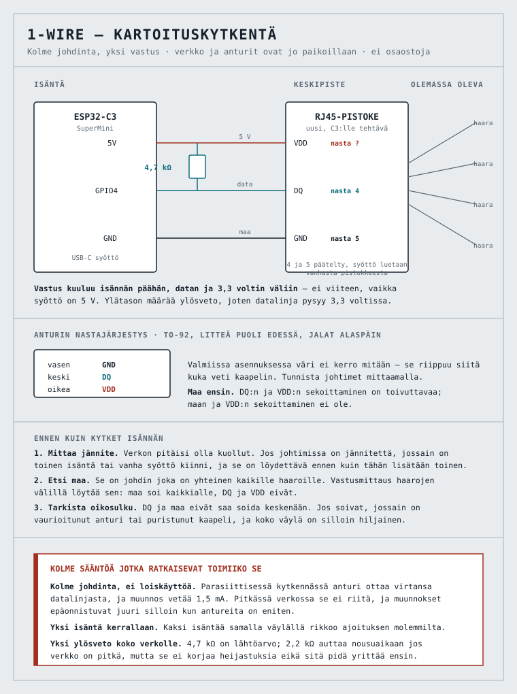
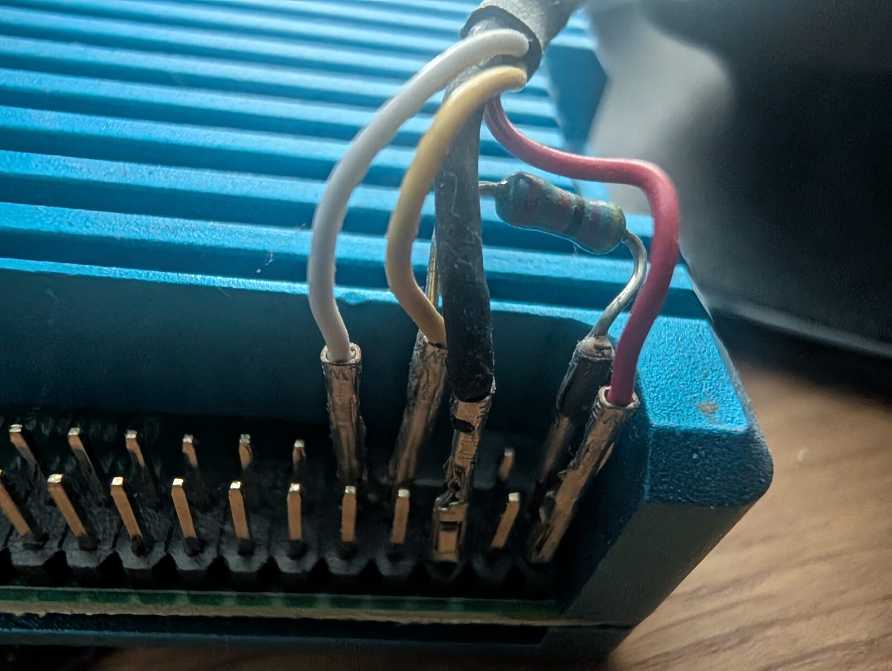
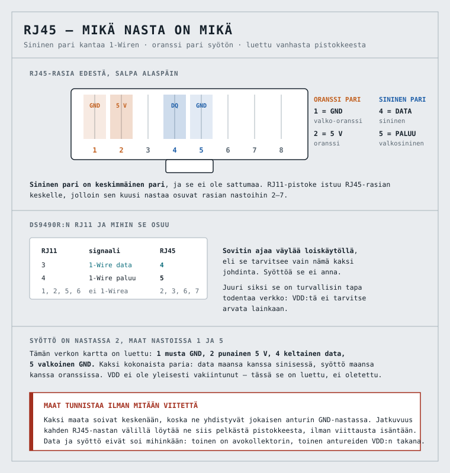

# Talon 1-Wire-väylä → Home Assistant

> **Yleiskuva.** Tekniset tiedot ja perustelut: [CLAUDE.md](CLAUDE.md).

Talossa on **valmis 1-Wire-verkko jossa on DS18B20-antureita**, eikä se ole
käytössä. Kaapelointi ja anturit ovat siis molemmat jo paikoillaan; puuttuu vain
isäntä ja konfiguraatio.

Tämä on repon ensimmäinen projekti joka alkaa olemassa olevasta
infrastruktuurista. Kaikki muut ovat alkaneet tyhjästä laatikosta.

## Tila

**Inventaario on palautettu, kytkentä on tekemättä.** Vanhan Raspberryn levyltä
löytyi OWFS-toteutus vuosilta 2015–2020 ja siinä valmis laitekartta:

| | |
|---|---|
| **19** | DS18B20-lämpötila-anturia, nimettyinä huoneisiin |
| **1** | DS2438, lämpötila ja kosteus, tekninen tila |
| **5** | DS2406-kytkintuloa varastossa, käyttötarkoitus tuntematon |

Nimet kertovat mitä ne mittaavat: **rakennetta, eivät huoneilmaa.** Pareja
*sisä* ja *ulko* samassa paikassa, ikkunoiden ja ovien kohdilla, osa
katonrajaan. Taulukko osoitteineen on [CLAUDE.md](CLAUDE.md):ssä.

**Myös ryhmittely huoneittain on tallessa.** Asennus eteni vuonna 2015 huone
kerrallaan ja listaus otettiin joka vaiheessa, joten kunkin askeleen uudet
osoitteet ovat sen huoneen antureita. Ryhmittely täsmää PHP:n nimiin ilman
yhtään ristiriitaa — kaksi riippumatonta lähdettä samasta asennuksesta.

Kaksi seurausta:

- **Lattialämmityksen suunnitelma ei muutu.** Anturit eivät ole valussa, joten
  ne eivät korvaa [stiebel.eltronin](../stiebel.eltron/) 25 anturin
  jakotukkiasennusta. Se kysymys on suljettu.
- **ESPHome lukee näistä 19.** DS2438 ja DS2406 eivät ole sen omissa
  komponenteissa, joten kosteus ja viisi kytkintuloa jäisivät lukematta ilman
  OWFS:ää. Tarkistettava, mutta ei este.

## Kytkentä



Kolme johdinta ja yksi vastus. **Ylösveto kuuluu isännän päähän**, datan ja
3,3 voltin väliin, ja niitä on yksi kappale koko verkolle — ei yhtä per haara,
koska rinnakkaiset ylösvedot laskisivat yhteisvastuksen liian pieneksi.

| RJ45 | Johdin | C3 |
|---|---|---|
| **1** | musta | GND |
| **2** | punainen | **5V** |
| 3 | — | — |
| **4** | keltainen | **GPIO4**, ja **4,7 kΩ tästä 3V3:een** |
| **5** | valkoinen | GND |

Data nastassa 4 ja sen maa nastassa 5 on **sininen pari**; syöttö nastassa 2 ja
sen maa nastassa 1 on **oranssi pari**. Kumpikin signaali kulkee oman
paluujohtimensa kanssa samassa kierteessä — pidä se niin myös uudessa
kaapelissa.

**Syöttö on 5 V ja ylösveto 3,3 V.** Se ei ole epäjohdonmukaisuus vaan se mikä
on toiminut tässä talossa vuosia: anturit saavat täyden jännitteen pitkälle
vedolle, mutta datalinjan ylätason määrää yksin ylösveto, joten linja heilahtaa
vain 3,3 volttiin ja on turvallinen C3:lle.

**Ylösveto menee 3V3:een eikä viiteen.** Se on tämän kytkennän ainoa kohta jossa
virhe tuhoaa GPIO:n.

**Kytke molemmat maat, äläkä hajota pareja.** Maat ovat rinnan — ne yhdistyvät
sekä Raspberryn maatasossa että jokaisen anturin GND-nastassa — joten toisen
unohtaminen ei riko mitään, ja *juuri siksi* se jäisi huomaamatta kunnes pitkän
vedon jännitehäviö alkaisi oireilla kaukaisimmalla anturilla. Pidä data ja sen
maa samassa kierretyssä parissa ja syöttö ja sen maa toisessa.

**Johdinvärit ovat tässä asennuksessa sattumaa** — kaapeli on se joka sattui
olemaan käsillä — eivätkä ne tarkoita mitään. Nastanumerot sen sijaan ovat
pääteltävissä:

| Signaali | RJ45 | Raspberryn rima |
|---|---|---|
| DQ | **4** | 7 (GPIO4) |
| GND | **5** | 9 |
| VDD | kolmas käytössä oleva paikka | 1 |

Data ja paluu seuraavat siitä että **DS9490 on toiminut tässä verkossa**: sen
RJ11-pistoke ylettyy vain rasian keskimmäisiin nastoihin, joten muualla ne eivät
olisi olleet sovittimen ulottuvilla lainkaan. Syöttö ei seuraa siitä, mutta kun
kaksi paikkaa kolmesta on tiedossa, **kolmas näkyy vanhasta pistokkeesta
silmällä.** Koko ketju premisseineen on [CLAUDE.md](CLAUDE.md):ssä.

**Vanha kaapeli on mittalaite.** Sen toisessa päässä on Raspberryn rima, jonka
nastojen merkitys tiedetään: nasta 7 on GPIO4 eli data, nasta 1 on 3,3 V ja
nasta 6 on maa. Jatkuvuus RJ45-pistokkeesta rimaan antaa taulukon suoraan.

### C3 tarvitsee oman kaapelinsa



**Kuva on vanhasta toteutuksesta**, ei siitä mitä rakennetaan. Se dokumentoi
yhden asian joka ei selviäisi mistään muualta: **ylösveto on isännän päässä**,
juotettuna suoraan riman kahden nastan väliin. Verkossa itsessään ei ole
ylösvetoa.

Raspberryn kaapeli jää paikalleen ja koskemattomaksi. C3:lle tehdään vastaava:

1. **Uusi RJ45-pistoke**, samat kolme paikkaa kuin vanhassa. Väri saa olla mikä
   tahansa — paikka ratkaisee, ei väri. Liitä se verkkoon **RJ45-jatkoholkilla**:
   rasiaa ei tarvitse avata, vaihto Raspberryn ja C3:n välillä on kahden
   sekunnin operaatio, ja holkki pakottaa yhden isännän kerrallaan fyysisesti.
2. **Toinen pää suoraan C3:een juotettuna.** Ei rimaa eikä dupont-liittimiä —
   sama peruste kuin stiebelin solmussa: katkeileva datakontakti lukee nollana
   antureita, eikä se erotu mitenkään muista syistä joilla väylä on hiljainen.
3. **4,7 kΩ DQ:n ja VDD:n väliin** C3:n päässä.
4. **Vedonpoisto** siihen kohtaan mistä kaapeli lähtee levyltä.

**Molemmat isännät eivät saa olla kiinni yhtä aikaa.** Kun C3:n pistoke menee
rasiaan, Raspberryn pistoke tulee pois — tai päinvastoin. Kaksi isäntää samalla
väylällä rikkoo ajoituksen molemmilta.

## Ennen kuin kytket isännän

Verkko on vieras, eikä siitä ole dokumentaatiota. Kolme mittausta, kaikki
yleismittarilla ja yhteensä viisi minuuttia:

1. **Mittaa jännite.** Verkon pitäisi olla kuollut. Jos johtimissa on
   jännitettä, jossain on toinen isäntä tai vanha syöttö yhä kiinni — ja se on
   löydettävä ennen kuin tähän lisätään toinen. **Kaksi isäntää samalla
   väylällä rikkoo ajoituksen molemmilta.**
2. **Etsi maa.** Se on johdin joka on yhteinen kaikille haaroille: maa soi
   kaikkialle, DQ ja VDD eivät. Valmiissa asennuksessa johdinväri ei kerro
   mitään, koska se riippuu siitä kuka kaapelin veti.
3. **Tarkista oikosulku.** DQ ja maa eivät saa soida keskenään. Jos soivat,
   jossain on vaurioitunut anturi tai puristunut kaapeli — ja koko väylä on
   silloin hiljainen riippumatta siitä mitä isäntä tekee.
4. **Mittaa DQ:n ja VDD:n väli.** Verkkoa on ajettu myös Raspberryn GPIO:sta,
   joka vaatii ulkoisen 4,7 kΩ:n ylösvedon — ja jos se asennettiin keskipisteeseen
   eikä Raspberryn päähän, se on yhä siellä. **~4,7 kΩ tarkoittaa ettei toista
   lisätä**; avoin tarkoittaa että omansa tarvitaan.

**Maa ensin, ja se on tärkeysjärjestys eikä tapa.** DQ:n ja VDD:n sekoittaminen
on toivuttavaa; maan ja VDD:n sekoittaminen ei ole.

## Kartoitus kahdessa vaiheessa

Verkko päättyy RJ45:een, ja talossa on ollut **DS9490-USB-sovitin**. Se muuttaa
järjestyksen, koska sovitin on turvallisempi kartoitustyökalu kuin ESP.



### Vaihe 1 — kaksi johdinta, DS9490

Sovitin ajaa väylää **loiskäytöllä**, eli se tarvitsee vain datan ja paluun. Se
ei anna syöttöä, ja juuri siksi se on turvallinen: **VDD:tä ei tarvitse arvata
lainkaan**, ja väärin arvattu VDD on ainoa virhe tässä projektissa joka tuhoaa
antureita sen sijaan että jättäisi väylän hiljaiseksi.

Data ja paluu ovat **RJ45:n nastat 4 ja 5** eli sininen pari. Se ei ole sattumaa:
DS9490R:n RJ11-liitin kantaa 1-Wiren nastoissa 3 ja 4, ja RJ11-pistoke istuu
RJ45-rasian keskelle niin että sen nastat osuvat rasian nastoihin 2–7.

Linuxissa väylä luetteloituu ytimen omalla ajurilla:

```sh
sudo modprobe ds2490 wire
ls /sys/bus/w1/devices/
```

Jokainen `28-`-alkuinen hakemisto on yksi DS18B20. **Tämä on koko vaiheen 1
tulos:** montako anturia verkossa on ja mitkä ovat niiden osoitteet.

### Vaihe 2 — kolme johdinta, ESP

Vasta kun data ja paluu on todettu oikeiksi, etsitään syöttöjohdin ja
rakennetaan pysyvä solmu. Kytkentä on [`wiring.svg`](wiring.svg):ssä ja
konfiguraatio [`discovery.yaml`](discovery.yaml):ssa.

**VDD ei ole vakiintunut mihinkään nastaan.** Data ja paluu ovat, mutta
syöttöjohdin voi olla 1, 2 tai 6 sen mukaan kuka kaapelin veti — se mitataan,
ei pääteltä kaaviosta.

Kummassakin vaiheessa sama sääntö: **käynnistä uudelleen pari kertaa ja vertaa
luetteloa.** Yksi onnistunut luettelo ei todista mitään, koska tähtitopologian
vika on nimenomaan se että löytyneet anturit vaihtuvat ajojen välillä. Sama
luettelo kolmesti on se mikä todistaa.

**ESPHomen lokitasosta:** älä laske sitä INFO:on. Osoiteluettelo tulostuu
CONFIG-tason vedoksessa, ja INFO vaientaa juuri sen rivin jota ollaan hakemassa.
Sama mekanismi piilotti solmun IP-osoitteen stiebelin käyttöönotossa.

**Yksi isäntä kerrallaan.** Jos DS9490 on kiinni, ESP ei saa olla — eikä
toisinpäin. Kaksi isäntää samalla väylällä rikkoo ajoituksen molemmilta.

## Jos mitään ei löydy

Järjestyksessä, halvimmasta ylöspäin:

| Epäilty | Testi |
|---|---|
| DQ ja VDD ristissä | vaihda ne keskenään ja käynnistä uudelleen |
| ylösveto puuttuu tai on väärässä paikassa | mittaa: DQ:n pitäisi levätä 3,3 V:ssa |
| maa ei ole maa | palaa mittaukseen 2 |
| koko haara irti keskipisteessä | kokeile yhtä haaraa kerrallaan |

Jos yksittäinen haara toimii mutta kaikki yhdessä eivät, vika on topologiassa
eikä kytkennässä — ja korjaus on haaroittaa tähti omille nastoilleen. Se on
`one_wire`-komponentissa pelkkä toinen merkintä eri nastalla, ks.
[CLAUDE.md](CLAUDE.md).

## Osoitteesta sijainniksi

Osoite on pysyvä ja yksilöllinen mutta se ei kerro sijainnista mitään.
Kartoitus tehdään menetelmällä joka on tässä repossa todettu vahvimmaksi:
**muuta yhtä asiaa ja katso väylää.** Lämmitä yksi anturi kädellä ja katso mikä
osoite liikkuu. Kymmenen sekuntia per anturi, eikä jälkikäteen jää mitään
tulkittavaa.

Jos anturit ovat seinän sisässä eikä niihin pääse käsiksi, kartoitus tapahtuu
lämmityksen kautta ja on hitaampi — mutta se on silti sama menetelmä.

**Kirjaa pari heti kun se on todettu.** Ilman sitä konfiguraatio on lista
heksalukuja joiden merkitys on yhden ihmisen muistissa.

## Rauta

**ESP32-C3 SuperMini**, ja peruste on varastosta eikä tekniikasta: C3:ita on
kuusi, joista kaksi on ilman varausta. Vapaat D1 minit ovat aidonin
vakuutus — se on repon ainoa käynnissä oleva tuotantojärjestelmä eikä sille ole
varalevyä, ja HAN-portin virtabudjetti sulkee ESP32:n siitä pois.

Tekninen puoli tukee samaa valintaa kahdella perusteella, jotka molemmat ovat
merkityksellisiä vasta jos antureita on paljon: enemmän muistia entiteeteille ja
vakaampi keskeytyskäsittely bittiä heiluttavalle ajoitukselle. Ks.
[CLAUDE.md](CLAUDE.md).

**Osaostoja ei ole.** Yksi vastus ja levy hyllystä.
