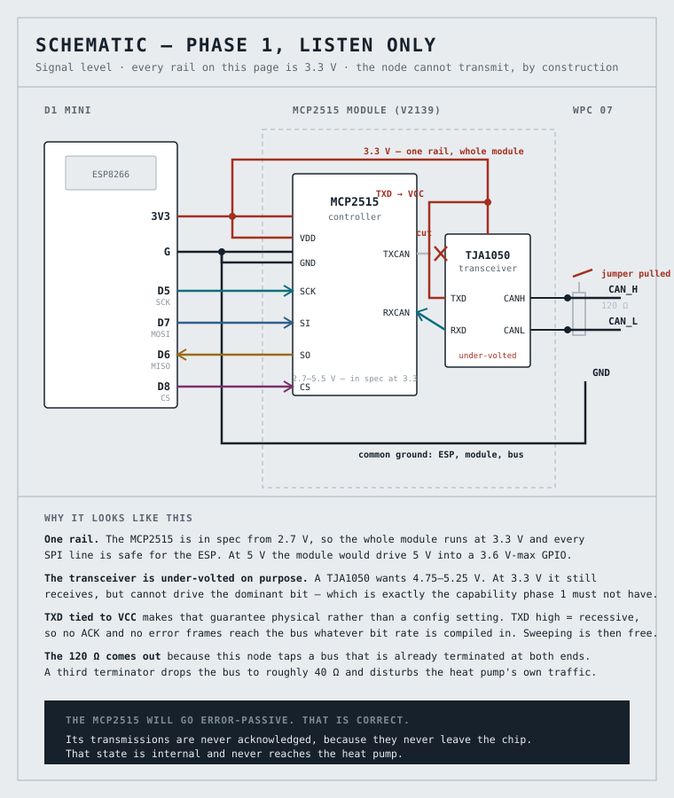
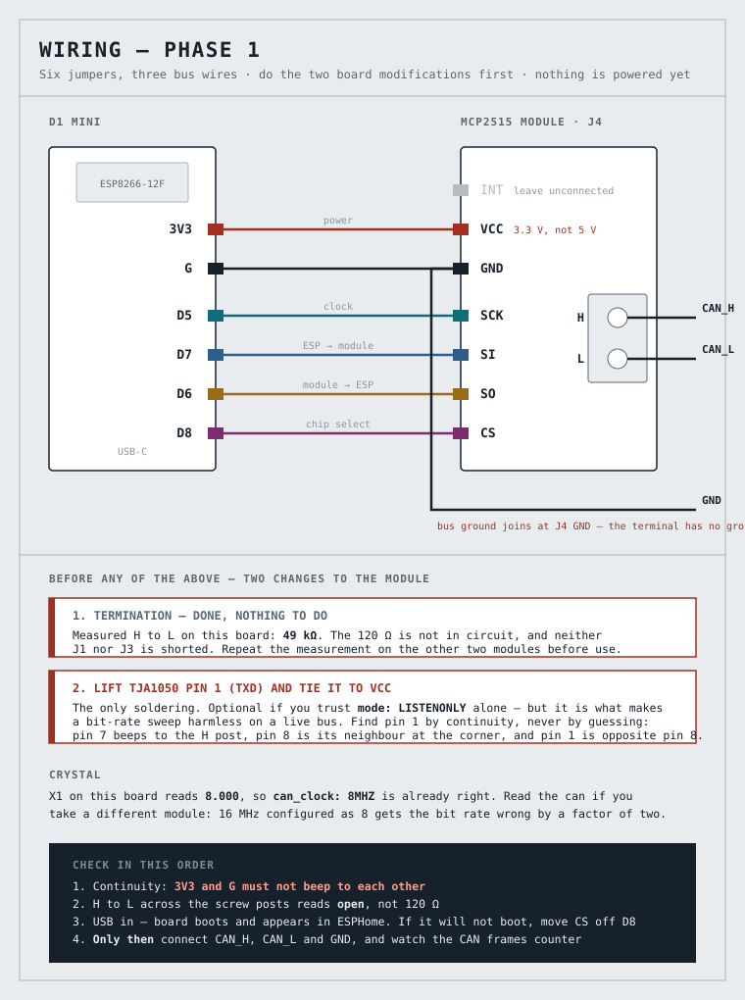
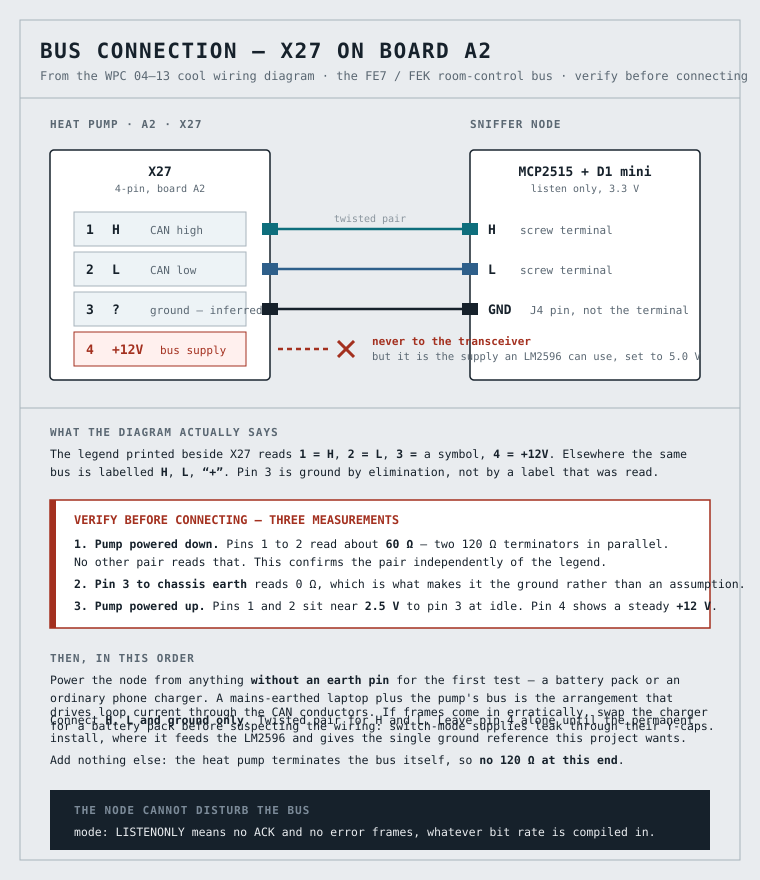
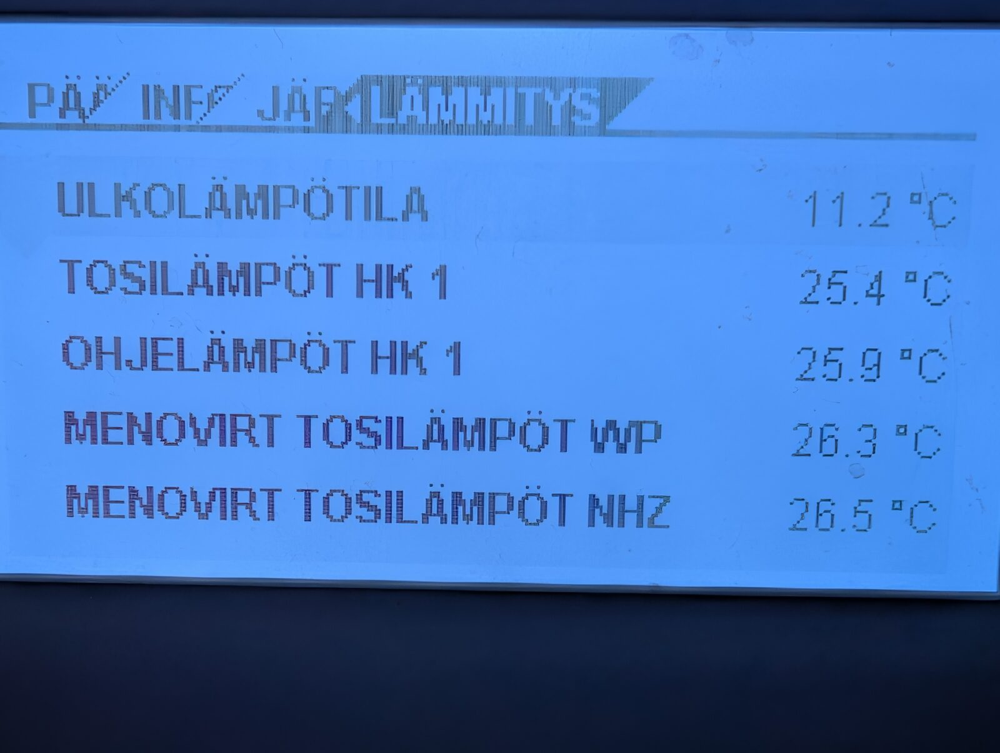
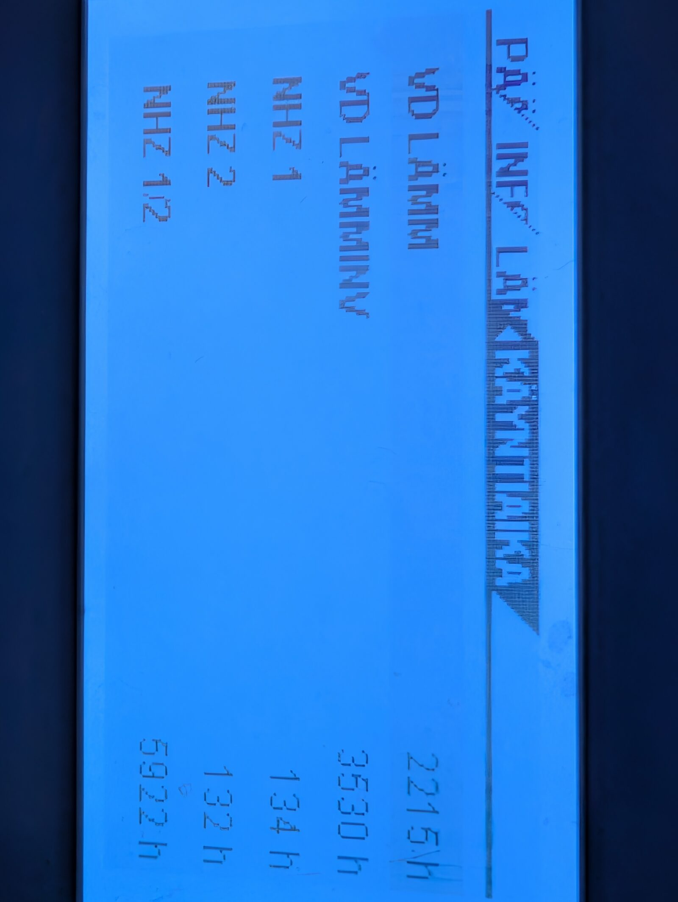
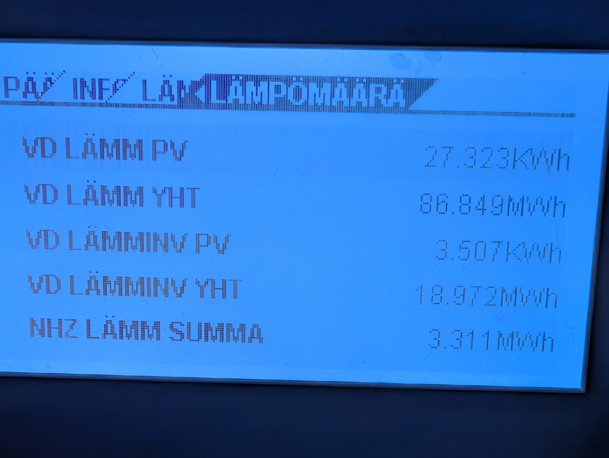
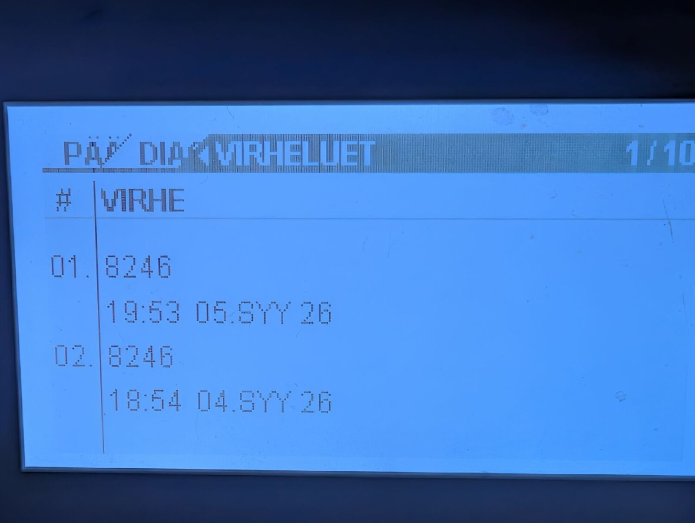

# Reading a Stiebel Eltron heat pump over CAN — zero euros, one weekend

> **Build log, part one of two.** This half is the listening node: what was on
> the shelf, what got wired, what went wrong, and what the bus turned out to be
> saying. Part two is writing to it.
> Overview: [README.md](README.md). Technical detail: [`CLAUDE.md`](CLAUDE.md).

A Stiebel Eltron WPC 07 shows perhaps a dozen numbers on its front panel, one
screen at a time, and you have to stand in the technical room to read any of
them. Behind that panel is a CAN bus carrying **144 distinct data elements** and
about **95,000 frames a night**.

Result: **51 entities in Home Assistant**, read-only, from a node that has never
transmitted a single frame. Cost **zero euros** — every part was already in the
box. Bought new, the whole bill of materials is about six.

---

## Starting point

There is no official interface. Stiebel sells an internet gateway; this machine
does not have one, and buying one would mean a manufacturer's cloud account for
data already travelling on a twisted pair inside the casing.

The bus runs the **Elster protocol at 20 kbps** — a scheme shared across a family
of German heat pumps, documented by hobbyists rather than by the manufacturer.
Six node addresses are occupied, and two polling loops run continuously without
anyone touching anything: the manager asks the external device every five
seconds, the panel asks the boiler every ten.

That traffic is there whether or not anyone listens. The whole project is a tap.

## Device choice: MCP2515 or the ESP32's own CAN

The ESP32 has a built-in CAN controller. Using it would drop the MCP2515, the
SPI wiring, the crystal question and the level shifting in one go.

It was rejected, and the rejection is worth stating precisely: **this is an
ESPHome limit, not a silicon one.** ESPHome's `esp32_can` component refuses bit
rates below 25 kbps on the plain ESP32, and the bus runs at 20. The chip on hand
is an ESP32-D0WD-V3 rev v3.1, whose divider reaches 20 kbps without trouble.

So: **Wemos D1 mini plus an MCP2515 module.** The MCP2515 does 20 kbps
unconditionally, and writing is not where the ESP8266 is weak — the controller
handles bit timing, arbitration, acknowledgement and retransmission in hardware,
and the MCU only moves frames across SPI.

## Parts

All of it already in the box:

- **Wemos D1 mini** (ESP8266), about €3 new
- **MCP2515 + TJA1050 module**, silkscreened V2139, about €2 new
- A length of **Cat5e installation cable** — solid conductors, pairs already
  twisted. One pair for CAN high and low.

Nothing else. No transceiver, no level shifter, no soldering on the module —
and the reason for that last one is the next section.

**Check the crystal before anything else.** The module's X1 is marked `8.000`,
so 8 MHz. A 16 MHz board configured as 8 MHz gets the bit rate wrong by a factor
of two and nothing decodes — and the symptom is silence, which looks exactly
like a wiring fault.

## The one decision that shaped everything: listen-only

A CAN controller is not passive by default. In normal mode it **acknowledges
every frame it receives** and transmits error frames when it sees something
malformed. Put a node with the wrong bit rate on a live heat pump bus and it does
not quietly fail — it actively disrupts the machine's own traffic. That is a
real risk when the bit rate is the thing you are trying to confirm.

The hardware answer is to lift pin 1 of the TJA1050 transceiver and tie it high,
which makes transmission physically impossible. The software answer is
`mode: LISTENONLY`.

**The installed ESPHome supports it, so nothing was lifted.** That is what makes
phase 1 a zero-soldering job on the module. Keep the pin lift in mind anyway as
the hardware belt to the software braces: if a future ESPHome upgrade ever drops
the option, the lift is what makes a bit-rate sweep safe again.

## Wiring



Hardware SPI on the D1 mini:

| MCP2515 | D1 mini |
|---|---|
| SCK | D5 |
| SO (MISO) | D6 |
| SI (MOSI) | D7 |
| CS | D8 |
| INT | **leave unconnected** |
| VCC / GND | 3V3 / G |

ESPHome's `mcp2515` component polls; it takes no interrupt pin, so INT stays
open. **If the board fails to boot, move CS off D8** — GPIO15 must be low at
boot, and a floating chip-select line can hold it high.



The whole module runs at 3.3 V. There is no level shifting anywhere in phase 1,
because nothing needs 5 V.

### The bus tap



The tap point is `X27` on control board A2, taken from the manufacturer's own
installation manual rather than guessed. It is a **spring terminal**: solid
conductor stripped 8–10 mm and pushed in bare, or stranded wire with a bootlace
ferrule crimped on.

**Never tin the end.** Solder cold-flows under the constant pressure of a clamp:
the contact force bleeds away over months, resistance climbs, and the result is
an intermittent joint that is nearly impossible to find later. Tinning exists to
hold strands together, and a solid conductor is already one piece of copper. If
a single conductor feels too thin for the clamp, fold the stripped end into a
hairpin rather than reaching for solder.

This is also why Cat5e **installation** cable and not a patch cord: the stiff
in-wall kind has solid conductors and goes in bare, while a flexible patch lead
is stranded and needs a ferrule.

### Two measurements before connecting anything

Both with the machine de-energised, and both took a minute:

- **Across the module, H to L: 49 kΩ.** The on-board 120 Ω terminator is not
  fitted, so it does not need desoldering.
- **Across the bus, H to L: 150 Ω.** There is no terminator on this bus at all.
  A 120 Ω terminator anywhere in parallel would make 150 Ω impossible, since a
  parallel combination never exceeds its smallest member.

That second reading also settles a community claim — that the heat pump
terminates the bus itself. It does not, on this machine.

## First capture

The build lands at **flash 45.2 %, RAM 40.0 %** on a D1 mini. Frames appeared at
the first configured bit rate; no sweep was needed.

An Elster frame is seven bytes:

```
byte 0   receiver's high bits (>> 3) in the high nibble, command in the low
byte 1   receiver's low bits — nonzero only for a sub-addressed node
byte 2   element index, or 0xFA meaning "index is in bytes 3-4"
```

A read and its answer, straight from the capture:

```
0x480 → E1 00 FA FE 4C 00 00      read request
0x700 → 92 00 FA FE 4C 00 12      response, value 0x0012
```

The lesson that took longest to learn is one line of the decoder:
**dispatch on sender *and* element, never element alone.** The same index means
different things on different nodes. Element `0xFDF4` from `0x700` is a return
temperature; the published element list's name for that index is something else
entirely, and the list is wrong for this machine on at least four counts.

That was established by correlation before any table agreed — 400 samples against
the boiler's own return temperature, matching to a **median absolute difference
of 0.0 K**.

## Three problems on the way

### 1. The receive stall

The MCP2515 has two receive buffers, and ESPHome polls them from the main loop.
A long loop stall — a WiFi reconnect, a burst of logging — fills both, sets the
overflow latch, and the controller stops delivering frames. Not an error, not a
warning. Just silence.

Fix: count frames, and if the count has not moved for 20 seconds, restart.

### 2. The watchdog's own boot loop

Which introduced a second bug. ESPHome's safe mode counts boots, and its default
"boot is good" window is one minute. A node that runs 26 seconds and restarts
never resets that counter — after ten such restarts it comes up in safe mode
**without the CAN component at all**, quietly, for the rest of the night.

Fix: `boot_is_good_after: 15s`, below the watchdog's own window, so a node that
is merely being restarted always counts as having booted.

In eleven hours of ordinary running the watchdog fired **once** and recovered in
14 seconds. During a session of heavy logging it fired three times in four
minutes.

### 3. Frames that are not data

This one is a direct consequence of listen-only mode, and it was a surprise. The
MCP2515 datasheet is explicit: in listen-only, **both valid and invalid messages
are received**, and the error counters are reset and deactivated. A frame
corrupted on the wire is normally destroyed by an error flag from some node —
this node sends none, and no other node's flag can un-receive a frame this one
has already latched.

Four classes turned up:

| | What arrives | Guarded |
|---|---|---|
| 1 | A **sender identifier** that cannot exist — the scheme makes every real address a multiple of `0x080` | yes |
| 2 | **Sentinel values** `0x8000`, `0x9000`, `0x8080`, meaning "not present". As tenths: −3276.8 °C | yes |
| 3 | An **out-of-range value** on a real element: 1584 once, against a lifetime range of 0 and 51–58 | no |
| 4 | A **corrupted element index** — an answer tagged as an element nobody asked for | deliberately not |

The fourth is the subtlest. One element answered 135 twice, in the millisecond
after four consecutive reads of a *different* element whose value is exactly 135
and whose index differs by one bit. Twenty-eight such frames have been seen, and
**none of the indices they carry was ever requested**. A response answers a
request; an unrequested response is not protocol traffic.

It is left unguarded on purpose: rejecting any element the manager did not just
ask for is exactly the mechanism by which a genuinely new element would be found.

**And the rate is a floor, not a measurement.** Only corruptions that land
*outside* the known element set are visible. A flipped bit that turns one real
index into another real index is delivered, published, and indistinguishable
from data. The median filter on the three fast temperatures is the only thing
between that class and Home Assistant's history.

## The method that actually worked

Passive capture names very little. You get numbers with no labels.

What works is the panel. On any screen the machine **asks the bus** for every
value it displays. Turn on logging of read requests, walk the menus, photograph
each screen, then intersect: for each photograph, find the elements read between
it and the next, and look for one whose value matches a number on the screen.



Six minutes of this named **27 elements to the digit**. Eleven hours of passive
capture had named almost nothing.

Two practical notes. A phone stamps the file name in UTC and the EXIF in local
time — the EXIF is the one to trust, and it lines up with the log to the second.
And ambiguity shows up as two elements holding the same number; it is resolved by
finding a screen that shows one of them alone.



Five counters on one screen, all exact.

## What the bus turned out to be saying

**A measured COP.** The machine keeps heat delivered and electricity consumed as
separate lifetime counters. For hot water: **18.972 MWh of heat from 7.526 MWh
of electricity — a coefficient of performance of 2.52**, over the machine's whole
life rather than a test cycle.



That number came with a trap. Every row on the consumption screen begins `VD` —
*Verdichter*, the compressor. There is no row for the electric element at all.
Read carelessly, 7.526 MWh looks like the machine's total, and then the element's
own counters become arithmetically impossible.

This project wrote that impossibility down, called the element list wrong, and
concluded the element was disabled. **All of it was wrong, and the error was one
abbreviation.** The lesson survives its own counterexample: checking a table
against a conservation law is the right instinct — but confirm what the
denominator measures before declaring anything impossible.

**A fault list that is not faults.**



Twelve entries, one code, roughly twice a day. The panel files them under *fault
list* because that is the only list it has. The code is the **EVU block** — the
utility load-control input — and on this installation it is not the grid
operator's doing. Home Assistant drives that input from the spot price, to keep
the compressor off during expensive hours.

The log agrees: the entries are not a fixed schedule but a varying one — two on
some days, one on others, none at all on two days in August. A contracted block
would not skip two days; a price threshold would, on a cheap one.

Which makes the corresponding register worth an entity, but not for the obvious
reason. Home Assistant already knows when it *asked* for a block. What it has
never had is the machine's own report that the block arrived and took effect.

**A flow temperature that was there all along.** The return had been readable
from two independent nodes since the first capture; the flow from none — until a
panel screen named two elements, and both turned out to have exact twins on the
module that answers every five seconds whether or not anyone is at the panel. The
quantity was never missing. It was being logged continuously under an index
nothing had named.

## What is unfinished

- **Twenty elements still unnamed.** Most answer zero or a sentinel, which is why
  they were never worth chasing.
- **Two elements that both read 30**, one of which is the hot water hysteresis
  and the other a correction offset. They answer together on every screen that
  asks for either, so nothing in a photograph separates them.
- **A pump hypothesis.** One element modulates through 0, 8, 12 and 100 — a
  strange set for anything but a pump — and the commissioning menu turned out to
  carry two pump powers as percentages. Suggestive, not proven.

## What I would do differently

**Measure before naming.** The single worst habit this project had was naming an
element from one sample that happened to match a plausible value. It was done
twice, and the second time the warning against it had already been written into
the same file a few hours earlier.

What emerged is a hierarchy, weakest to strongest:

1. A single sample matching a plausible value — **worthless**
2. Correlation over hundreds of samples — good
3. A screen photographed with the log running — better
4. **Changing one value and watching the bus** — best

That last one is not just the strongest evidence, it is the shortest. When a
setting was toggled on the panel, the write appeared on the bus, named the
element outright, and captured the exact frame that would command it:

```
100>180 wr ex=0101 = 256
```

Ten seconds, and no ambiguity to argue about afterwards. If I started again, I
would reach for it on the first day instead of the last.

**And keep the wrong reasoning.** The technical file for this project runs to
2,300 lines, and a surprising amount of it is retractions written underneath the
claims they retract. Not because errors are charming, but because the reasoning
is usually sound and the premise is usually what failed — and you cannot see
which is which if only the conclusion survives.

## What follows

Part two is writing: taking an address on the bus, sending the frames that have
now been captured, and driving the heating curve and the hot water setpoint from
the spot price. Two write frames are already on record. The address is free.

And the hardware question reopened at the last minute. The ESP32 route was
rejected because ESPHome refuses 20 kbps — but the refusal names the plain ESP32
specifically, and ESPHome tabulates supported rates **per variant**. One line
changed in a validation file, one command that needs no hardware:

```
canbus:
  - platform: esp32_can
    bit_rate: 20KBPS
    variant: ESP32S3

INFO Configuration is valid!
```

An ESP32-S3 takes it. That removes the MCP2515, the SPI wiring, the crystal
question and the receive stall in one move — and possibly the index corruption
too, since the flipped bits cluster in a way that points at the read path rather
than the wire.

Which is a lesson of its own: that command cost nothing and had been sitting
unrun in the documentation for weeks.
