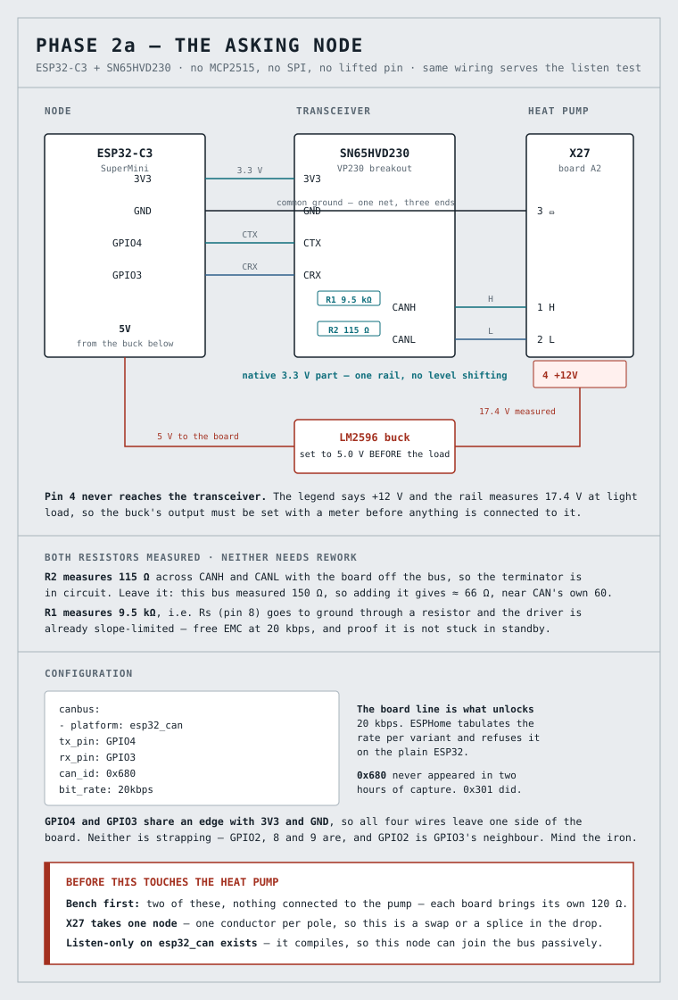

# Deleting the CAN controller — the one inside the chip was enough

> **Build log, part two.** Part one was the listening node and what the bus
> turned out to be saying. This half is the node being replaced: the MCP2515
> leaves the project, the decoding moves across unchanged, and the panel walk
> settles what the energy counters actually are.
> Overview: [README.md](README.md). Technical detail: [`CLAUDE.md`](CLAUDE.md).

Part one ended on a command that cost nothing and had been sitting unrun in the
documentation for weeks. Running it took one line and one minute, and it deleted
a chip, a bus, four jumpers and the worst recurring fault this project has had.

Result: **the MCP2515 is gone.** An ESP32-C3 reads the same heat pump bus from
its own built-in controller at **237 frames a minute**, with **zero malformed
frames in 6,199** — a sample that includes a full panel walk, which is the
heaviest load this bus can be given. The decoding moved over unchanged. Every
entity kept its identity and its history.

---

## Where part one left off

The ESP32's built-in CAN controller had been rejected early, and the rejection
was recorded precisely: **an ESPHome limit, not a silicon one.** ESPHome refuses
bit rates below 25 kbps on `esp32_can`, and this bus runs at 20.

What went unnoticed for weeks is that the refusal message names the plain
`ESP32` specifically, and ESPHome tabulates supported rates **per variant**. Four
board lines, one validation command, no hardware:

```
esp32dev             20 kbps REFUSED
esp32-s3-devkitc-1   20 kbps accepted
esp32-c3-devkitm-1   20 kbps accepted
esp32-c6-devkitc-1   20 kbps accepted
```

Three of four take it. The bus stops deciding the board, and price decides
instead.

**The C3 is the one worth buying.** It does this job at roughly a third of the
S3's price, its USB is native — which retires the CH34x-versus-CP210x driver
question this repo keeps tripping over — and it has about ten times the D1 mini's
usable RAM. The C6 adds an 802.15.4 radio, which is the one capability none of
the others can be given later, but nothing here needs it.

## Why replace a node that worked

Phase 1 ran for weeks on the D1 mini. It confirmed the bit rate, captured
95,000 frames a night and produced the entire decoder. The board was never the
problem.

**The MCP2515 was.** It latches an overflow flag when both receive buffers fill,
and reception then stops for good until the chip is reset — the node stays
online, the log stays clean, and no frame ever arrives again. A stalled node and
a quiet bus look identical from the outside, which is what makes it dangerous
overnight.

The workaround was a watchdog that restarts the node when the frame counter
stops moving. It worked, and it cost: one capture ran 26 seconds alive for every
150 dead, and the watchdog tripped three times in a single morning. Restarting
that often trips ESPHome's own boot-loop protection, so `safe_mode` needed
tuning to stop the node quietly booting without its CAN component at all.

And phase 2 — writing — needed a 3.3 V transceiver bought regardless, because
the module's TJA1050 cannot drive a dominant bit at 3.3 V. So the choice was
never "keep it or buy something". It was:

| | Keep the MCP2515 | Move to the C3 |
|---|---|---|
| Parts | D1 mini + MCP2515 + transceiver | C3 + transceiver |
| Work | SPI wiring, a lifted pin, the crystal question | four wires |
| Known fault | the overflow latch | — |

The C3 route removes parts rather than adding them, and it frees a D1 mini for
the one project in this repo that has no spare board.

## Reading the transceiver with a meter, not with its marking

The transceiver is a bare six-pad SN65HVD230 breakout: `3V3, GND, CTX, CRX,
CANH, CANL`, two resistors marked R1 and R2, headers supplied loose. Three cost
what a single branded board does.

Two measurements decide how it is used, and both are made with the board
connected to nothing:

- **R2, across CANH and CANL: 115 Ω.** The 120 Ω terminator is fitted and in
  circuit. On this bus — which measured 150 Ω, that is, unterminated — it stays.
- **R1, from the Rs pin to ground: 9.5 kΩ.** The transceiver ships in
  slope-limited mode, which at 20 kbps is a free EMC improvement in a cabinet
  full of compressor contactors.

**The meter is the instrument, not the silkscreen**, and this project already
owns the lesson: the MCP2515 module's terminator is marked `121` and is
physically on the board, yet it measures 49 kΩ across the terminals because
neither jumper is shorted. A photograph looked like fitted jumper caps. The
marking says what a part is; only the meter says whether it reaches the bus.

R1 had a third possible reading worth naming: **an open Rs pin means standby**,
where the driver is off and the symptom is zero frames — indistinguishable from
a wrong bit rate, bad wiring or a quiet bus. Five minutes with a meter removes a
suspect that would otherwise have to be eliminated with the machine running.

## A new board looks broken

Plug in a factory-fresh SuperMini and it re-enumerates every two seconds. With
native USB every reset drops the USB connection, so the kernel log fills with
`cdc_acm … ttyACM0` followed by `USB disconnect` on a loop, and esptool fails
with `No such file or directory` because the port it wants disappears between
enumeration and open.

It reads like a dead board or a charge-only cable. It is neither: **the flash is
empty**, so the ROM tries to boot, fails, and resets.

**Hold BOOT while plugging in.** Download mode never starts the application, the
cycle stops, and the port stays put long enough to flash. `esptool flash_id`
then confirms the part:

```
Chip is ESP32-C3 (QFN32) (revision v0.4)
Features: WiFi, BLE, Embedded Flash 4MB (XMC)
```

That flash size matters and is worth reading rather than assuming — the same
check in this repo's electricity-meter project overturned a listing that claimed
"4MBit", which would have been 512 kB and not enough for OTA.

## Wiring: four wires, one edge



| C3 | | SN65HVD230 | | X27 |
|---|---|---|---|---|
| 3V3 | → | 3V3 | | |
| GND | → | GND | → | 3 (reference) |
| GPIO4 | → | CTX | | |
| GPIO3 | → | CRX | | |
| | | CANH | → | 1 (H) |
| | | CANL | → | 2 (L) |

**GPIO4 and GPIO3 rather than 4 and 5**, because on a SuperMini those two share
an edge with 3V3 and GND while GPIO5 is on the opposite side. All four wires
then leave the board from one place. Neither is a strapping pin — GPIO2, 8 and 9
are, and GPIO8 also drives the on-board LED.

GPIO2 being GPIO3's immediate neighbour is worth one line of caution, not
because bridging pins is a thing anyone does deliberately but because of **how
that particular slip presents**. Strapping pins are sampled at reset, so a stray
solder bridge there produces a board that will not boot — the same two-second
re-enumeration loop an empty flash produces. A bridge between two ordinary data
pins would only cost frames, which is a far easier fault to reason about.

**No headers.** The earlier advice in this project's notes says to fit the
supplied header on the logic side, and that advice belongs to the MCP2515 route,
where the logic side is six SPI jumpers and one of them lands on a lifted pin.
Here the logic side is four short wires between two boards that will live
together for the rest of their working lives. Every connector is a contact that
can oxidise or work loose, and **an intermittent CTX or CRX reads as zero
frames** — which in this project is indistinguishable from everything else that
reads as zero frames. Four soldered joints remove eight contact faces.

The whole node is on one 3.3 V rail. The SN65HVD230 is a native 3.3 V part, so
there is no level shifting anywhere — which is the entire reason it was chosen
over the module's 5 V TJA1050.

### X27 takes one node

The tap point is a spring terminal with **one conductor per pole**. There is no
second drop to be had, so the new node is a swap at the terminal or a splice in
the drop wire, never an extra pair pushed into the same holes.

Swapping is the cleaner move, and the old node is left assembled rather than
dismantled: putting two wires back is the rollback path.

One measurement confirms the swap before the machine is energised, and it
distinguishes three states that otherwise look the same:

| Reading across H and L | Meaning |
|---|---|
| **≈ 63 Ω** | both sides connected — the target |
| ≈ 115 Ω | only our board; the pump side is not making contact |
| ≈ 150 Ω | only the pump; our conductors are not seated |

A spring terminal's most common fault is a conductor that looks inserted and is
resting on its insulation. This reading catches it before anyone starts
suspecting bit rates.

## Listen-only exists, and that reordered the plan

A CAN node in normal mode acknowledges frames and emits error frames even when
it sends nothing of its own. On a live heat pump bus that is an active
participant, not an observer — which is why the original plan required a
two-node bench bus before the new node could be connected at all.

Whether ESPHome's `esp32_can` exposes listen-only was unknown. It was left in
the configuration deliberately, so that `esphome config` would answer the
question before anything was soldered:

```yaml
canbus:
  - platform: esp32_can
    mode: LISTENONLY
```

**It compiles.** So the node can join the live bus passively exactly as phase 1
did, and the bench bus stops being a prerequisite for the receive test. It
remains the prerequisite for transmitting, which is a different question.

Being honest about the strength of that: compiling proves the option exists, not
that the controller is silent on the wire. The margin is narrow — listen-only is
a TWAI hardware mode rather than a software convention — but it is not zero.

## On the bus

```
[S][sensor]: 'CAN frames' >> 673 frames
[S][sensor]: 'CAN frames' >> 831 frames
```

**237 frames a minute**, against a documented rate of "over 200". The C3 sees
the same bus the MCP2515 saw, and `esp32_can` stops being a rejection in this
project's notes and becomes what it runs on.

What that deletes, in one move: the SPI wiring, the lifted pin, the crystal
question, the level shifting, and the overflow latch with its restarting
watchdog. The new node's stall notice **warns and does not restart**, on
purpose — whether TWAI has that failure mode at all is part of what is being
measured, and a watchdog that papers over a stall would destroy the evidence
either way.

## Moving the decoder, not copying it

The frame handler is 500 lines of lambda that takes an identifier and seven
bytes. It knows nothing about which controller delivered them, so it ported
unchanged, along with about fifty entities. The MCP2515 configuration keeps its
copy as the rollback.

One thing did change, and it was a correction. The handler counts frames that
fail its shape check, and the first run on the C3 reported **21 rejects in 359
frames** — against the MCP2515's two in 95,000. Alarming, and wrong. The raw
lines settle it:

```
601 raw dlc=7  66 01 FE 01 00 00 00
180 raw dlc=7  66 79 FE 01 00 00 00
100 raw dlc=7  97 00 FE 01 00 00 00
```

Command nibble 6 or 7 in every one, and `0x79` in byte 1 of three — this bus's
system-frame signature, which is no address at all. They are legitimate traffic
in a layout the decoder does not use, and they arrive in bursts rather than only
at startup.

So they get their own counter. What remains in `malformed` is the genuinely
implausible: a length that is not seven, a command above 7, a marker byte beyond
`0xFA`, or a sender that is not a multiple of 0x080 plus 0–3. **On that
definition the count is zero in 6,199 frames.**

The lesson is not subtle: a counter whose name overstates what it measures will
be read as evidence by whoever finds it next, including the person who wrote it.

## One name, three collisions

Home Assistant builds entity ids from the device name, so the new node was given
the same one as the old — `wpc-can` — to inherit the entity ids, the history and
the long-term statistics rather than starting a parallel set beside them. The
bus makes that safe: one conductor per pole means the two nodes can never be
online together.

That reasoning covers the bus and not the host, and three collisions followed
from it:

- **mDNS.** With the old node unplugged, the dashboard still showed `wpc-can`
  online and the log client still resolved its stale address for minutes.
- **Home Assistant.** The new board has a different MAC, so HA registers a *new*
  device and offers to add it — while the old device entry still holds the
  entity ids. Adding it first would have appended `_2` to every entity, which is
  precisely the outcome the shared name exists to prevent. **Delete the old
  device first.**
- **The build directory.** ESPHome names it after the device, not the file, so
  two configurations for two different platforms compile into the same
  `.esphome/build/wpc-can/`.

The rule that falls out is sequential rather than parallel: only one `wpc-can`
in the host's config at a time. Done in that order, every entity kept its
identity and no history was lost.

## The counter that appeared to lose energy

With the node settled, a third panel walk went looking for the elements the
decoder still could not name: 1,474 read requests, 218 unclaimed responses,
thirty-four photographed screens.

The energy counters had never been fully mapped. Two screens and the log
together showed why:

```
LÄMPÖMÄÄRÄ      VD LÄMM PV      29.016 kWh
                VD LÄMM YHT     87.303 MWh
```

```
0x092F = 29   0x092E = 16      the day counter, 29.016 kWh
0x0931 = 87   0x0930 = 274     the stored base, 87.274 MWh
```

So each counter is **four consecutive indices — total MWh, total kWh, day kWh,
day Wh** — and the configuration had been reading three, dropping the
sub-kilowatt-hour remainder.

**And the panel's total row is not the base element: it already includes the
day.** 87,274 + 29.016 = 87,303.016, displayed as 87.303 MWh. The base appears
on no screen anywhere.

That cost an hour. Comparing a photographed total against the base element
shows a deficit exactly the size of the day counter, which reads like a counter
running backwards — and it is only two different quantities being held next to
each other. The mapping was right the whole time; the pairing was not.

With the remainder read, the entity now equals the panel to the watt-hour:
87303.016 against 87.303 MWh, 19089.033 against 19.089, 3311 against 3.311.

One design note on how the remainder is used. It is stored when it arrives and
is **never required** before publishing, because requiring it would invent a new
way for an entity to stall: a screen that asks for three parts and not the
fourth would leave the total unpublished forever. It is also **consumed by the
publish it arrives for**, so that a remainder read an hour ago cannot be added
to a total whose other parts are fresh. The error is bounded to "absent" and
never to "stale".

## What it costs

| | ESP8266 sniffer | C3, counters only | C3 with the full decoder |
|---|---|---|---|
| Flash | 45.2 % | 48.9 % | **49.7 % of 1.8 MB** |
| RAM | 40.0 % | 32.0 % | **33.1 % of 321 kB** |
| RAM free | ~48 kB | 218 kB | **215 kB** |

**The percentages are the misleading half.** The documented reason to leave the
ESP8266 was the read set growing — "50–100 entities would get tight" — and that
fear was written for a part with 48 kB free in total. Moving 500 lines of frame
handler and fifty entities onto the C3 cost **15.6 kB of flash and 3.8 kB of
RAM**. Fifty entities at about 75 bytes each is not what anyone was afraid of.

Bill of materials for the change: one ESP32-C3 SuperMini and one SN65HVD230
breakout, about four euros together, of which the transceiver was needed for
writing anyway.

## What I would do differently

**Run the cheap validation first.** The command that deleted the MCP2515 needed
no hardware, took a minute, and sat unrun in the documentation for weeks because
the conclusion above it read as settled. A rejection recorded with its reasoning
is not the same as a rejection that is still true — and this one named its own
expiry condition, per variant, in the same paragraph.

**Name counters after what they count.** "Malformed" described a shape check,
not corruption, and the gap between those two produced twenty minutes of
misplaced alarm and one wrong conclusion in the notes.

**Distrust a comparison before distrusting a measurement.** When the counters
appeared to run backwards, the first suspect should have been the pair being
compared, not the mapping that had just been confirmed against four screens.

## What follows

The node can now transmit, and the plan splits that into two steps rather than
one, because they are not the same risk.

**2a asks.** A read request changes nothing, and it is 44 % of this bus's normal
traffic — the panel fires 771 of them during a single menu walk. What it buys is
the values the bus does not volunteer: the DHW and flow setpoints were each
requested once in two hours of capture, so they sit unknown until something
asks. Reading on demand costs bus time, not wear: nothing is stored, so nothing
is consumed.

**2b sets.** The heating curve lives at 0x601/0x010E and reads 0.23, the hot
water setpoint at 0x180/0x0013 and reads 55.0, and the machine's own write
frames for them are on record byte for byte. That is where the project has been
going since the first capture: raising a setpoint when there is solar surplus
stores energy in the building mass and the tank, proportionally, working with
the heat pump's own logic instead of overriding it.

Writing is also where the constraints are. The setpoints are stored in
non-volatile memory sized for someone who changes them three times a year, so
the control loop writes on change only, with a deadband and a minimum interval —
and it prefers two or three discrete levels over tracking a cloud-flickering
surplus curve. A raised curve also has to clear itself without Home Assistant
being alive to clear it, because a house that overheats for a week is a more
expensive failure than one that never stored the surplus in the first place.

Both halves need the same two things: a transceiver that can drive the bus,
which is now soldered, and a bus identity, which the capture already chose —
0x680 never appeared in two hours, and 0x301 did.
